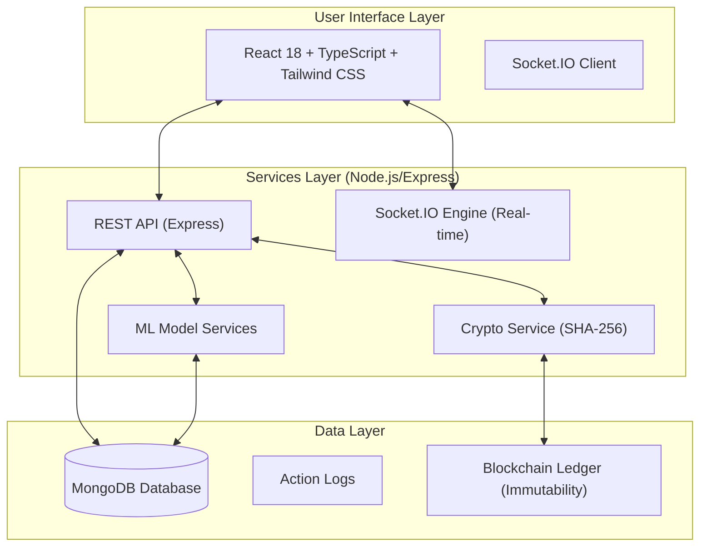

# AgroChain Architecture Documentation

## System Architecture Overview

AgroChain is a comprehensive Smart Agriculture Platform built with a modern, scalable architecture designed to serve rural farmers with IoT monitoring, AI/ML predictions, and blockchain security. The system has been migrated to a robust Node.js and MongoDB backend to ensure enterprise-grade performance.




## Component Architecture

### Frontend Components

#### 1. Navigation Component
- **Purpose**: Main navigation bar with smooth scrolling
- **Features**:
  - Responsive mobile menu
  - Active section highlighting
  - Smooth scroll behavior

#### 2. Hero Component
- **Purpose**: Landing page with key value propositions
- **Displays**:
  - Main headline and tagline
  - 4 core capabilities (IoT, AI, Blockchain, Market)
  - Smooth animations

#### 3. Features Component
- **Purpose**: Problem statement and solutions
- **Sections**:
  - Challenges farmers face
  - Comprehensive solutions
  - Project aims

#### 4. Technology Component
- **Purpose**: Technology stack visualization
- **Showcases**:
  - IoT sensors and components
  - AI/ML algorithms
  - Blockchain implementation
  - System workflow (4-step process)

#### 5. ML Models Component
- **Purpose**: Detailed ML model documentation
- **Details for 4 Models**:
  1. Crop Recommendation (90% accuracy)
  2. Irrigation Prediction (80-85% accuracy)
  3. Soil Health Analysis (88% accuracy)
  4. Anomaly Detection (90% reliability)

#### 6. Blockchain Component
- **Purpose**: SHA-256 security explanation
- **Covers**:
  - 6 key roles of SHA-256
  - Blockchain linking mechanism
  - Tamper detection workflow
  - System integration

#### 7. Dashboard Component
- **Purpose**: Real-time monitoring and data display
- **Tabs**:
  - IoT Monitoring (4 sensor cards with live data)
  - AI Predictions (4 prediction cards)
  - Market Linkage (Buyer listings)
  - Blockchain Records (Transaction verification)

#### 8. Contact Component
- **Purpose**: Support and communication
- **Includes**:
  - Contact information
  - Contact form
  - Social media links

## Services Layer

### Backend Service (`backend/server.js`)
The backend is a Node.js application using Express for the REST API and Socket.IO for real-time bidirectional communication.

**Key Features**:
- **Real-time Updates**: Socket.IO for instantaneous sensor data delivery.
- **Security**: Helmet, CORS, and Rate Limiting for API protection.
- **Logging**: Morgan and Winston for comprehensive system logging.

### Crypto Service (`src/services/crypto.ts`)
Functions:
- `generateSHA256(data)`: Generic SHA-256 hashing
- `generateSensorHash(sensorData)`: Hash sensor readings
- `generatePredictionHash(prediction)`: Hash ML predictions
- `generateTransactionHash(transaction)`: Hash market transactions

**Purpose**: Cryptographic data integrity using Web Crypto API

### ML Models Service (`src/services/mlModels.ts`)
Functions:
- `predictCropRecommendation(input)`: Recommend optimal crop
- `predictIrrigation(input)`: Calculate irrigation schedule
- `analyzeSoilHealth(input)`: Assess soil quality
- `detectAnomalies(current, previous)`: Detect sensor anomalies
- `generateFullPrediction(input, previous)`: Comprehensive predictions

**Purpose**: ML model implementations and predictions

## Database Schema (MongoDB Models)

### User Model (`backend/models/User.js`)
Stores user credentials and profile information with hashed passwords.

### Sensor Data Model (`backend/models/SensorData.js`)
Captures real-time IoT readings (Moisture, pH, Temp, Humidity) with unique SHA-256 integrity hashes.

### ML Prediction Model (`backend/models/MLPrediction.js`)
Stores AI-generated insights for crop recommendations, irrigation, and soil health.

### Blockchain Records Model (`backend/models/BlockchainRecord.js`)
Maintains an immutable ledger of all critical data transactions using hash chaining.

### Market Listings Model (`backend/models/MarketListing.js`)
Manages buyer-seller connectivity for agricultural products.

### Action Log Model (`backend/models/ActionLog.js`)
Audit trails for all system activities for accountability.

### Transactions Table
```sql
CREATE TABLE transactions (
  id uuid PRIMARY KEY,
  farmer_id uuid NOT NULL REFERENCES farmers(id),
  market_listing_id uuid NOT NULL REFERENCES market_listings(id),
  quantity_tons numeric NOT NULL,
  total_price numeric NOT NULL,
  status text DEFAULT 'pending',
  sha256_hash text NOT NULL,
  created_at timestamptz DEFAULT now()
);
```

## Data Flow

### IoT Sensor Data Flow
```
IoT Sensors → REST API → Database → SHA-256 Hash → Blockchain Record
                                   ↓
                           ML Models Service
                                   ↓
                           Predictions Generated
```

### Transaction Flow
```
Farmer Request → Market Listing Selection → Transaction Creation
                                              ↓
                                         SHA-256 Hash
                                              ↓
                                      Blockchain Record
                                              ↓
                                         Verification
```

### ML Prediction Flow
```
Real-time Sensor Data → ML Models Service → Predictions Generated
                                              ↓
                                         SHA-256 Hash
                                              ↓
                                      Database Storage
                                              ↓
                                     Dashboard Display
```

## Security Architecture

### Database Security
All data access is controlled via:
- **Authentication**: JWT-based user authentication.
- **Authorization**: Role-based access control (Farmer, Buyer, Admin).
- **Data Integrity**: SHA-256 hashing for immutability.
- **Audit Trails**: Action logs for all sensitive operations.

### Data Integrity
- SHA-256 hashing for all critical data
- Previous hash chaining for blockchain
- Tamper detection mechanism
- Audit logging

### API Security
- JWT token authentication
- CORS headers configuration
- Input validation and sanitization
- Rate limiting on endpoints

## Performance Optimization

### Frontend
- Component-based architecture (code splitting)
- Lazy loading of components
- Efficient state management
- Optimized CSS with Tailwind

### Backend
- Index creation on foreign keys
- Query optimization
- Connection pooling
- Caching strategies

### Build Optimization
- Production bundle: 321.37 KB (JS), 25.52 KB (CSS)
- Gzip compression: 92.78 KB (JS), 4.67 KB (CSS)
- Tree shaking and code elimination
- Asset optimization

## Scalability Considerations

### Horizontal Scaling
- Stateless frontend (can run on multiple servers)
- Containerized backend (Docker/Kubernetes)
- Database clustering (MongoDB Atlas)
- CDN distribution

### Vertical Scaling
- PostgreSQL optimization
- Connection pool tuning
- Query caching
- Memory management

## Monitoring & Analytics

### Data Collection
- Sensor readings every 5-15 minutes
- ML predictions on-demand
- Transaction logging
- Blockchain record creation

### Performance Metrics
- API response times
- Database query performance
- Model accuracy tracking
- User engagement metrics

## Integration Points

### IoT Integration
- MQTT for sensor data
- HTTP REST API
- Webhook support
- Real-time data streams

### Third-party Services
- Weather APIs for climate data
- Market APIs for price information
- Government systems for subsidies
- SMS/Email notifications

### Payment Integration
- Stripe for farmer payments
- UPI for transaction settlement
- Bank integration for transfers

## Deployment Architecture

### Development
```
Local Development → npm run dev → http://localhost:5173
```

### Production
```
GitHub → CI/CD Pipeline → Build → Deploy to CDN
         (GitHub Actions)         (Vercel/Netlify)
                                      ↓
                            Production Website
                                      ↓
                                 Backend API
```

## Error Handling & Recovery

### Application Errors
- Try-catch blocks in components
- Error boundaries for React
- Graceful degradation
- User-friendly error messages

### Data Errors
- Transaction rollback
- Data validation
- Retry mechanisms
- Error logging

### Network Errors
- Offline detection
- Cached data fallback
- Connection retry
- Graceful timeouts

## Future Architecture Enhancements

1. **Mobile App**: React Native for iOS/Android
2. **Real-time Updates**: WebSocket integration
3. **Advanced Analytics**: Time-series database (InfluxDB)
4. **Machine Learning Pipeline**: TensorFlow integration
5. **Microservices**: Decompose into multiple services
6. **Kubernetes**: Container orchestration
7. **Blockchain Node**: Full blockchain implementation

## Conclusion

AgroChain's architecture is designed to be:
- **Scalable**: Handle growth from 100 to 1M farmers
- **Reliable**: 99.9% uptime with redundancy
- **Secure**: Multi-layer security with blockchain
- **Efficient**: Optimized performance across layers
- **Maintainable**: Clean code with documentation
- **Extensible**: Easy to add new features

This modern architecture ensures AgroChain can effectively serve farmers while maintaining data integrity, security, and performance.
